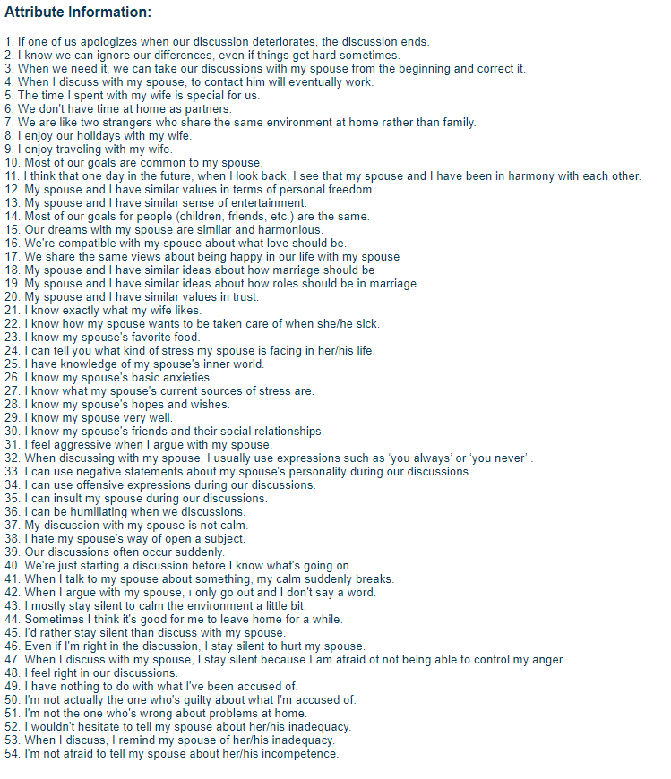

# This is Jia's Repository for Bayesian Data Analysis

My name is Jia Zhang, one of the MPS students majoring in Applied Statistics and Data Science. One interesting data analysis problem that I did in STSCI4740 was to determine the probility of a person getting divorced based on his/her answeres to 50 questions about marriage. Basically, I am really interested in using different statistical techniques to help make decisions and understand the world better. I have always wanted to take a course related to bayesian statistics since I was an undergrad. I have heard some "rumors" about Bayesian that it is superior to frequentist in some situations and Bayesian has been growing significantly fast recently. I am really looking forward to seeing how Bayesian can be applied to solving complicated real world problems.

